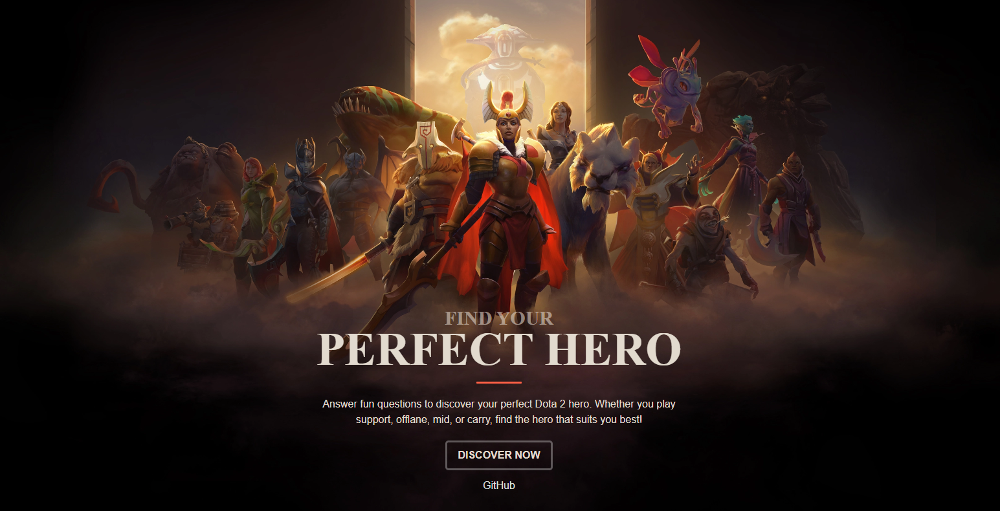
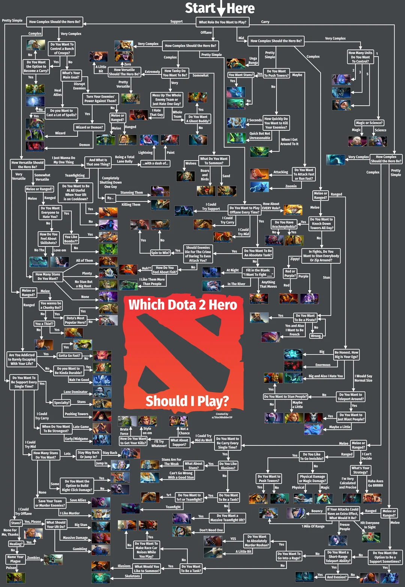

# 

Answer fun questions to discover your perfect Dota 2 hero. Whether you play support, offlane, mid, or carry, find the hero that suits you best! <a href="https://photkosee.github.io/dota2-hero-matchmaker/#/">Try now!</a>

### Table of Contents

1. [Inspiration](#inspiration)
2. [What this does?](#what-this-does)
3. [Built with](#built-with)
4. [Data Source](#data-source)
5. [Credits](#credits)
6. [Author](#author)
7. [Deployment](#deployment)
8. [Contributing](#contributing)

## Inspiration

A few days ago, I found a Reddit post sharing an idea of answering fun questions to find your ideal Dota 2 hero. It intrigued me, so I brought it to life.

## What this does?

Users will answer a list of questions step-by-step about their preferences for their ideal DOTA 2 hero. Once they have answered enough questions, their ideal hero will be displayed.

## Data Source

I convert a flowchart into a json object and treat it like a non-binary decision tree. The data is stored in `data.json` file.

  

## Credits

The idea of the flowchart is from a user named [StackBabber59](https://www.reddit.com/user/StackBabber59/) from [this Reddit post](https://www.reddit.com/r/DotA2/comments/1d6te1m/i_made_a_handy_flowchart_to_help_people_decide/). The images used in this project are credited to the [Dota 2 official website](https://www.dota2.com/home).

## Built with

- [Vite 5](https://vitejs.dev/) - Build tool
- [React 18](https://react.dev/) - Development environment
- [Tailwind CSS](https://tailwindcss.com/) - CSS framework

## Author

Phot Koseekrainiramon
- [LinkedIn](https://www.linkedin.com/in/phot-kosee/)
- [GitHub](https://github.com/photkosee)

## Deployment

This project is deployed to GitHub Pages:

[https://photkosee.github.io/dota2-hero-matchmaker/#/](https://photkosee.github.io/dota2-hero-matchmaker/#/)

## Contributing

Pull requests are welcome. Please open an issue first to discuss any improvements or bugs you'd like to fix. Potential issues could be typos in data.json or images of heroes not rendering due to invalid names. The sources for the images are from the [Dota 2 official website](https://www.dota2.com/home); some names used to render images might be old hero names.
